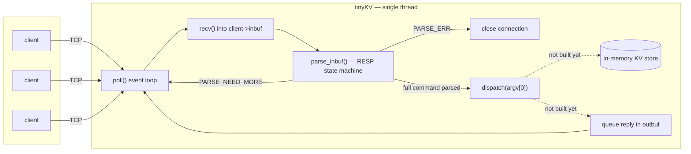
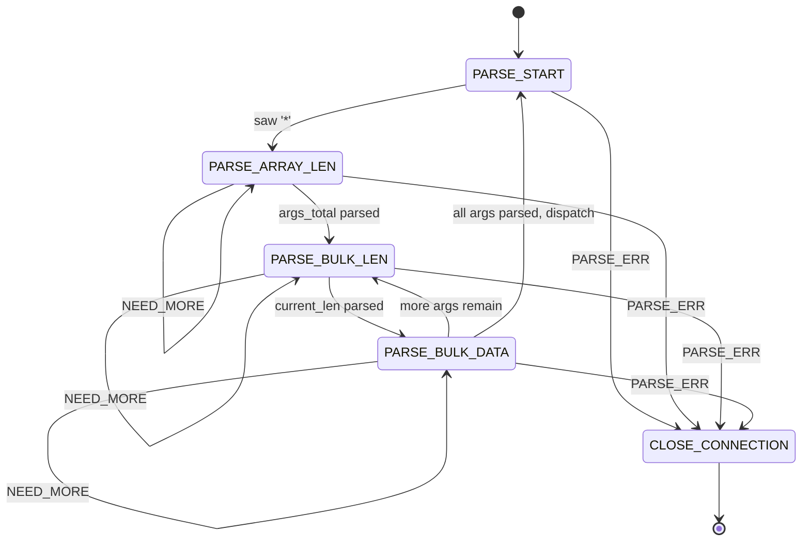

# tinyKV

A small Redis clone built from scratch in C — no frameworks, no libraries beyond the C standard library and POSIX sockets. Built to learn how Redis actually works internally (event loop, wire protocol, client state, command dispatch) by implementing it, not just reading about it.

**Status:** early-stage / actively changing. Protocol layer (RESP parsing) is fully implemented, but not yet wired into the server's `recv()` path — `parse_inbuf()` exists and works, nothing calls it yet. No commands are implemented. Expect the architecture below to shift as the server wiring, command dispatch, and storage get built.

## Why

Following [Arpit Bhayani's Redis-from-scratch playlist](https://www.youtube.com/playlist?list=PLsdq-3Z1EPT0eElcdOON9fdaeaQjlyXDt), but in C instead of Go. Redis itself is written in C — building in C means using the same primitives Redis uses (raw POSIX sockets, manual `poll`/`epoll`, manual memory management) instead of having a runtime hide the event loop from you. The goal is to learn the core pieces in depth: single-threaded event loop, non-blocking I/O, and the RESP protocol, all implemented by hand.

## Architecture

Single-threaded, non-blocking, one `poll()` loop driving everything — no worker threads, no async runtime.



Dotted arrows mark what's designed but not implemented yet (command dispatch, the KV store, reply encoding).

### RESP parser state machine

Every client connection carries its own parser state (`client_t.parser_state`) so a `recv()` returning a partial command doesn't lose progress — the state machine resumes exactly where it left off on the next readable event.



`parse_inbuf()` (`src/resp.c`) drives this loop, calling one of `parse_start_of_array()` / `parse_crlf_terminated_integer()` / `parse_crlf_terminated_string()` per state. Any `PARSE_ERR` from any state closes the connection immediately (no reply sent yet — see [Future functionality](#future-functionality)). On completing a command, state resets to `PARSE_START` rather than terminating, so pipelined commands already sitting in `inbuf` get picked up on the same call.

## Current status

- [x] Non-blocking TCP server: `socket()`/`bind()`/`listen()`/`accept()`, `poll()`-based event loop, per-client read/write buffering (`src/server.c`)
- [x] Per-client connection state (`client_t`): input/output buffers, parser state, `argv`/`argc` (`src/client.h`, `src/client.c`)
- [x] RESP parser fully implemented (`src/resp.h`, `src/resp.c`) — `parse_inbuf()` drives the full state machine above, including pipelining
- [x] Length-prefixed field parsing (`*N\r\n`, `$L\r\n`) via `parse_crlf_terminated_integer()`; bulk string bodies via `parse_crlf_terminated_string()` (uses the known length directly, not a CRLF scan, since bulk data can itself contain `\r\n`)
- [x] Protocol bound checks: `args_total ≤ MAX_ARGS` (100), bulk string length `≤ MAX_BULK_LEN` (4KB) — both currently `PARSE_ERR` + silent close, no reply yet
- [x] Binary-safe string type (`bstr_t`, `src/bstr.h`/`.c`) — `{len, data}`, takes ownership of a caller-provided buffer, no copy. `client->argv` is a contiguous `bstr_t` array, sized dynamically once `args_total` is known.
- [ ] Wire `parse_inbuf()` into `server.c`'s `recv()` path — parser is fully built but never called; the server can't process a real command yet
- [ ] Command dispatch (`argv[0]` → handler)
- [ ] In-memory key-value store
- [ ] `PING`, `SET`, `GET` commands
- [ ] `epoll()` migration

## Roadmap

1. Wire `parse_inbuf()` into `server.c`'s `recv()` path — the parser and `argv` storage are built and unit-testable in isolation, but the server doesn't call `parse_inbuf()` anywhere yet.
2. Command dispatch: `argv[0]` → handler.
3. In-memory key-value store (hash table).
4. `PING`, `SET`, `GET` commands.
5. Migrate `poll()` → `epoll()` once the protocol layer is solid.

## Good to have things

Will pick it up once core flow is working end to end.

- Streaming bulk-data reads (no hard size limit, read incrementally across multiple `recv()` calls).
- Proper protocol-error replies before closing a connection (currently a silent close).

## Building

```
clang-format -i <file>   # format a file before committing
```

(Makefile and `clang-tidy` linting planned, not yet added.)

## Project layout

```
server.c       — main loop, poll(), accept, connection lifecycle
client.h/.c    — client_t struct, add_client, close_client, queue_bytes, free_argv
resp.h/.c      — RESP parser (implemented, not yet called from server.c), response encoder (not started)
bstr.h/.c      — bstr_t binary-safe string type ({len, data}), used for argv
commands.h/.c  — SET, GET, PING handlers (not started)
```
